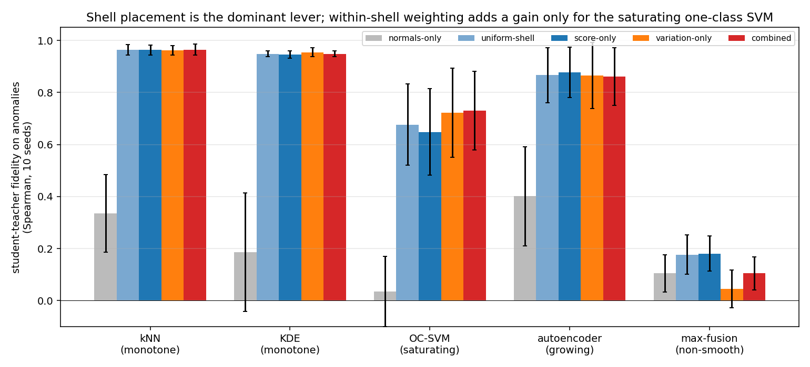
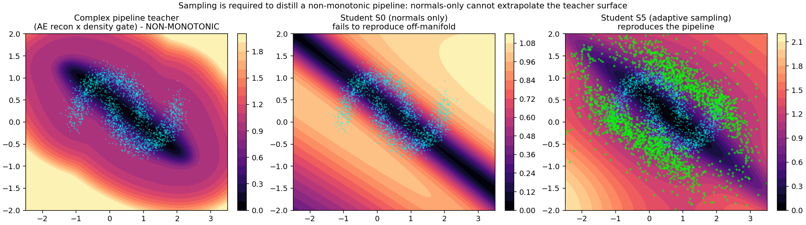
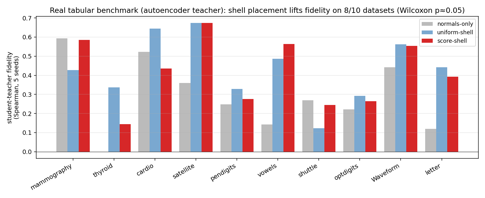
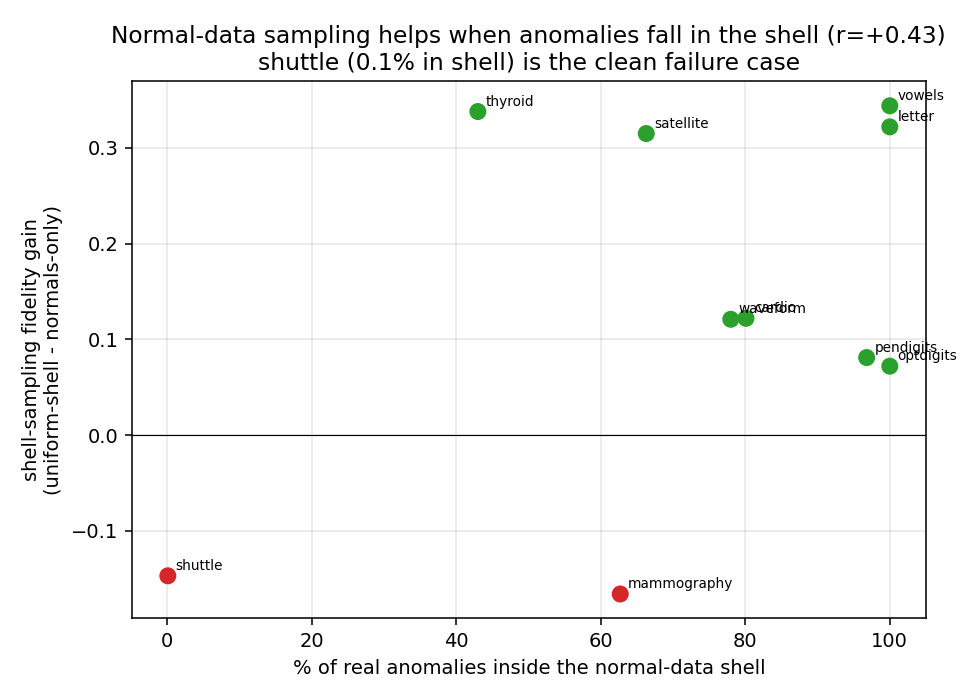
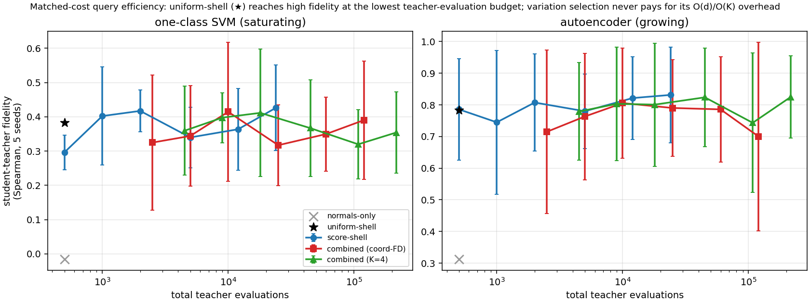

# Where to Query a Blackbox Anomaly Pipeline: Shell Sampling for Label-Free Distillation

## Abstract

A deployed unsupervised anomaly-detection **pipeline** chains preprocessing, one or more detectors, and a fusion step, and is often too heavy for the edge device it must run on. We study how to distill such a pipeline into a single small student model. The pipeline can only be queried, its internals are opaque, and no anomaly labels are available for training, acquisition, or model selection; the only source data is a set of normal operating samples (benchmark anomaly labels are used only for final evaluation where they exist). The student must therefore learn the pipeline's behavior on the anomalous region from synthetic query points we place there and label with the pipeline's own scores. The distillation objective is a plain regression from input to pipeline score; the question is **where a budget of synthetic queries should go**. On controlled geometry we find, across a spectrum of teacher pipelines (kernel density, k-NN distance, one-class SVM, and an autoencoder), that the dominant lever is placing queries in a **low-density shell** just off the normal manifold: any shell sampler lifts student-teacher rank fidelity from near zero to $0.68$–$0.96$. Importance weighting *within* the shell, by pipeline score or by local score variation, adds a further gain specifically for **saturating** pipelines (the one-class SVM: an equal score/variation mixture reaches $0.73$ versus $0.68$ for uniform-shell sampling), while for monotone and growing detectors uniform-shell sampling is already as good. We measure success as student-teacher **fidelity** on held-out anomalies (rank agreement), not standalone detection accuracy, and account for the pipeline evaluations each sampler spends. On controlled manifolds up to ambient dimension 64, the **shell-placement** effect carries over — a normal-data-defined shell beats normals-only at every dimension — while the within-shell variation weighting stops adding value beyond two dimensions, and a dimension-independent $O(K)$ variation estimator matches the $O(d)$ coordinate one. On ten real tabular anomaly datasets distilled from an autoencoder teacher, shell placement gives a statistically detectable fidelity lift over normals-only ($8/10$ datasets, paired Wilcoxon $p \approx 0.05$). On three genuine composite pipelines (including Isolation Forest and a gated ensemble) shell placement again lifts fidelity, but absolute reproduction is much lower than for single detectors and barely improves with a wider student, so high-fidelity distillation of real fused pipelines remains open. The robust, dimension- and pipeline-spanning finding is shell *placement*; within-shell variation weighting is a narrower, low-dimensional refinement. All code and results are open-source.

## 1. Introduction

Unsupervised anomaly detection in production is rarely a single model. A deployed pipeline chains a preprocessing stage, one or more detectors from different families (density estimators, tree-based isolators, distance-based methods, deep autoencoders), and a fusion or calibration step. When such a pipeline must run on a device with tight compute, memory, and power budgets, the practitioner faces a distillation problem: compress the pipeline into one small model whose scores approximate the pipeline's on the inputs the device will see.

Distillation is worth doing only when the teacher is itself hard to deploy; otherwise one would simply ship it. That is the common case for anomaly detectors. Many are **non-parametric**, with a footprint that grows with the training set: k-NN and kernel density store all training points, one-class SVM stores its support vectors, Isolation Forest stores its trees. On the real datasets of §6.5 these teachers occupy tens of kilobytes to about a megabyte and grow with $N$, whereas the fixed-width student we distill into is a few kilobytes regardless of $N$ (§7.1). A composite pipeline compounds the problem by stacking several such models. So the teachers worth distilling are exactly the non-parametric detectors and multi-stage pipelines, and the value of the student is a constant-size, low-latency stand-in for a model whose size or structure does not fit the target.

Two features make this different from ordinary supervised knowledge distillation [Hinton et al., 2015]. First, the teacher is a **pipeline**, not a differentiable model: we can query it end-to-end and read the scalar score it returns, but we cannot backpropagate through it. Second, the training set is **fully unsupervised**: only normal samples exist, and no labeled anomalies are ever available. Whatever the student learns about the pipeline's behavior on abnormal inputs, it learns from query points we construct and label with the pipeline itself.

This paper asks a single question: *given a budget of synthetic queries, where in input space should they go so the student best reproduces the pipeline?* Our contributions:

- **Off-support acquisition is the main lever.** Normal-only distillation leaves the anomaly-side score surface unidentified; against a uniform-shell baseline we show that simply placing queries in a low-density shell off the manifold is what recovers fidelity, far more than any weighting within the shell. (§4.2, §6.1)
- **Within-shell weighting is a targeted, not universal, gain.** Importance weighting by pipeline score or by *local score variation* improves over uniform-shell sampling specifically for saturating pipelines (the one-class SVM), where the variation signal captures the score's edge; for monotone and growing detectors uniform-shell sampling is already as good, and for a non-smooth fusion the weighting is counterproductive. (§4.3, §6.1)
- **Robust equal mixture.** Where weighting helps, an equal score/variation mixture hedges over the pipeline's shape without inferring it; a coefficient sweep shows the equal mix is best or flat on every teacher we can reproduce. (§4.4, §6.2)
- **Query cost and capacity.** We account for the pipeline evaluations acquisition spends, give a dimension-independent $O(K)$ local-variation estimator (with its fidelity cost on the saturating case), and use a student-width sweep to separate query-limited from capacity-limited reproduction. (§4.3, §5, §6.4)

We measure student-teacher **fidelity** on held-out anomalies (rank agreement) because the goal is faithful reproduction of the pipeline, not beating it. We evaluate on two-dimensional benchmarks and a spectrum of five teacher pipelines, and report a real high-dimensional limitation openly (§6.5).

## 2. Related work

### 2.1 Knowledge distillation and blackbox distillation

Knowledge distillation transfers a large teacher's input-output behavior to a smaller student by matching soft outputs [Hinton et al., 2015; Ba and Caruana, 2014; Buciluă et al., 2006], extended to feature and relation matching [Romero et al., 2015; Park et al., 2019]. Our objective is a plain squared-error match on pipeline scores. Data-free distillation [Nayak et al., 2019; Chen et al., 2019] synthesizes inputs when training data is unavailable, typically by inverting the teacher's activations; our setting is intermediate, since we have the normal data but not the anomalies the deployed student must handle, so we synthesize queries to cover that region.

Mathematically the closest line of work is **query-efficient blackbox model extraction**: training a surrogate from a queryable model by choosing informative queries. This includes prediction-API model stealing [Tramèr et al., 2016], query selection for functional cloning [Orekondy et al., 2019], active-learning-based extraction [Pal et al., 2020], data-free stealing with zeroth-order gradient estimation [Kariyappa et al., 2021], and query-efficient data-free transfer [Zhang et al., 2023]. That literature also makes the query-cost of gradient estimation explicit, which motivates our accounting (§5) and the dimension-independent estimator (§4.3). Our setting differs on two axes that make the acquisition problem asymmetric: the teacher emits a scalar anomaly score rather than class posteriors, and normal source data are available while the region whose ranking must be reproduced is precisely the region absent from that data. We study the intended, authorized-compression use of this capability; see the limitations for the relation to unauthorized extraction.

### 2.2 Unsupervised anomaly detection

The teacher pipelines we distill are built from standard unsupervised detectors: density estimators such as Gaussian kernel density [Silverman, 1986] and Local Outlier Factor [Breunig et al., 2000]; boundary methods such as one-class SVM [Schölkopf et al., 2001] and Deep SVDD [Ruff et al., 2018]; isolation and distance methods such as Isolation Forest [Liu et al., 2008] and k-NN distance; and reconstruction methods such as autoencoders [Zhou and Paffenroth, 2017]. A unifying review [Ruff et al., 2021] catalogues these families and their persistent score-calibration difficulty across families, which our rank-based normalization addresses. Recent deep detectors include self-supervised [Bergman and Hoshen, 2020; Golan and El-Yaniv, 2018] and reconstruction-driven industrial methods [Zavrtanik et al., 2021; Roth et al., 2022; Li et al., 2021]; our student is architecture-agnostic to the pipeline it distills.

### 2.3 Synthetic query synthesis and off-manifold sampling

The idea of generating negatives in a neighborhood of the normal manifold is closest to **DROCC** [Goyal et al., 2020], which assumes normals lie near a low-dimensional manifold and synthesizes adversarial negative points in a shell around them to *train an anomaly detector*. Outlier Exposure [Hendrycks et al., 2019] and boundary-generation methods [Ngo et al., 2019, Fence GAN] likewise show that the choice of non-normal training points strongly shapes an anomaly model. Our aim is different: we do not train a detector but reproduce an *existing* blackbox scorer, our target is teacher fidelity rather than anomaly classification, and our question is *where inside* the off-manifold region teacher queries are most informative for that reproduction. Other routes to synthesizing off-normal points include adversarial near-boundary generation [Ducoffe and Precioso, 2018; Chen et al., 2020] and score-based or diffusion samplers that draw from a density defined through its score function [Song and Ermon, 2019, 2020]. Our sampler places queries by importance-weighting an off-manifold shell rather than training a generator, and does not require differentiating the teacher.

### 2.4 Active learning and query synthesis

Constructing new query points rather than selecting from a pool is *query synthesis* [Angluin, 1988], distinct from the pool-based active learning that dominates the modern literature [Sener and Savarese, 2018; Settles, 2010]. The score-gradient signal we use is related to disagreement- and margin-based acquisition [Seung et al., 1992; Houlsby et al., 2011; Ducoffe and Precioso, 2018]. Langevin dynamics for concentrating samples in target regions has a long history [Welling and Teh, 2011; Song and Ermon, 2019]; we implement both a Langevin variant of our sampler and a simpler importance-weighted form, and use the latter for the main comparison because it is easier to reason about and needs no step-size tuning.

## 3. Problem setup

Let $P$ be a blackbox anomaly-scoring pipeline mapping an input $x \in \mathbb{R}^d$ to a scalar score $s(x) = P(x) \in \mathbb{R}$, oriented so larger means more anomalous. We have:

- a training set $\mathcal{X} = \{x_i\}_{i=1}^N$ of **normal** samples;
- query access to $P$: we may evaluate $s(x)$ at any $x$, but cannot inspect or differentiate $P$;
- **no labeled anomalies**, at train or validation time.

We want a compact student $f_\theta : \mathbb{R}^d \to \mathbb{R}$ that reproduces $s$ at deployment, exported as a framework-agnostic graph (e.g. ONNX) and compiled for the target runtime. The distillation objective is a plain regression; the contribution is the placement of the synthetic queries used to fit $f_\theta$.

**Success metric.** Because the goal is to reproduce the pipeline, we measure student-teacher **fidelity** on a held-out anomaly set $\mathcal{A}$: the Spearman rank correlation between $f_\theta(a)$ and $s(a)$ over $a \in \mathcal{A}$. This rewards faithful reproduction of the pipeline's ranking on inputs the student was never trained to match, rather than the student's standalone detection accuracy. All acquisition and student hyperparameters (shell bounds, mixture coefficient, student width, early stopping) are set from normal data and pipeline queries only; the anomaly set $\mathcal{A}$ is touched once, for final reporting.

## 4. Method: shell sampling

### 4.1 Why normals-only distillation fails

Fitting the student only on the normals,
$$
\theta^\star = \arg\min_\theta \frac{1}{N}\sum_{i=1}^N \bigl(f_\theta(x_i) - s(x_i)\bigr)^2,
$$
constrains it only where the pipeline already scores inputs as normal — and there the pipeline's scores are, by construction, all "normal", carrying almost no signal about how it ranks the anomaly side. Running over the whole training set is therefore not enough no matter how large it is: off the manifold the student is unconstrained, a small network interpolates smoothly, and it has no way to reproduce the pipeline's actual off-manifold surface. This is the crux of the setting: because there are no anomalies to train on, the only way to teach the student the pipeline's anomaly-side ranking is to **query the pipeline off the manifold ourselves**, at the boundary of the normal region. We add synthetic boundary queries $\{q_j\}_{j=1}^M$ that carry the pipeline's behavior on the anomalous side, and fit
$$
\mathcal{L}(\theta) = \frac{1}{N}\sum_i \bigl(f_\theta(x_i) - s(x_i)\bigr)^2 + \gamma\,\frac{1}{M}\sum_j \bigl(f_\theta(q_j) - s(q_j)\bigr)^2 .
$$
The question is where to place the $q_j$.

### 4.2 Where: the low-density shell

Let $\rho(x)$ be the distance from $x$ to its nearest training normal in the standardized feature space (a cheap proxy for data density). Queries are wasted in two places. **On** the manifold ($\rho \approx 0$) the normals already supply the target. In the **far field** ($\rho$ large) the queries are inefficient for either pipeline shape: a saturating pipeline returns a constant ceiling that carries no new information, and a growing pipeline returns a smooth monotone extrapolation that a few anchors already pin down, while the behavior that actually distinguishes deployment anomalies is the near-boundary structure closer in. The informative region is the **low-density shell** $\{x : \rho_{\min} \le \rho(x) \le \rho_{\max}\}$: off the manifold, but close enough that the pipeline's decision structure is still resolved. All samplers below draw candidates from this shell. In the continuous, standardized feature spaces we study, a shell point is a geometrically plausible off-normal input; for mixed or bounded tabular features, Euclidean proximity does not guarantee a valid input, and queries would need to respect categorical levels and box constraints (or be generated in a decoded latent space). We return to this in the limitations.

### 4.3 What: score and local variation depend on the pipeline shape

To make signals comparable across heterogeneous detectors we convert each raw score to a **monotone rank** on the training normals. Sort the training scores $s_{(1)} \le \dots \le s_{(N)}$ and map $s_{(i)} \mapsto i/(N+1)$; for an arbitrary input, $u(x)$ is the piecewise-linear interpolation of $s(x)$ between adjacent training scores. Above the training maximum $u$ is extended linearly with the slope of the top decile of training scores, capped at $2$, so that inputs scoring above every normal receive distinct values greater than one (a plain clip at one collapses the entire off-manifold region to a tie and destroys the ranking exactly where the queries live). This transform is invariant to any strictly monotone rescaling of the raw score up to the tail slope, which is the property we want when comparing detectors on different scales.

Within the shell, which candidates are informative depends on how the pipeline behaves off the manifold:

- **Growing pipelines** (the rank $u$ keeps rising with distance, e.g. autoencoder reconstruction error): the informative queries are toward **high score**. Weight candidates by $u(x)$.
- **Saturating pipelines** (the rank $u$ plateaus off the manifold, e.g. one-class SVM whose decision function flattens): high-score weighting is uninformative because most of the shell is already at the plateau; the informative queries are where the score **changes**. We measure this by the **local score variation** $v(x)$, a finite-difference estimate of how much $u$ changes around $x$. In the experiments below $v$ is the coordinate finite-difference magnitude $\|\Delta_h u(x)\|$; because that costs $O(d)$ pipeline evaluations per candidate, we also test a query-efficient estimator that averages $K$ random directional differences (Appendix A), whose cost is $O(K)$ and independent of dimension. We call this "local variation" rather than "gradient" because $u$ is only piecewise-linear, so $v$ is a finite-scale roughness measure, not a true derivative. No access to pipeline internals or derivatives is required.

### 4.4 The combined sampler

Rather than choose per pipeline, weight each shell candidate by **both** signals:
$$
w(x) \;\propto\; \tfrac{1}{2}\,\widehat{u}(x) \;+\; \tfrac{1}{2}\,\widehat{v}(x),
$$
where $\widehat{g}(x) = g(x) / \sum_{x' \in \text{pool}} g(x')$ normalizes each signal to a probability over the candidate pool (so the two terms are comparable and the $\tfrac12$/$\tfrac12$ mix is meaningful), and we draw $M$ queries by importance sampling. This is an **equal mixture** (a hedge), not an adaptive rule: it does not infer the pipeline's shape and re-weight, it simply carries both acquisition signals so that whichever one the pipeline rewards is present. The score term serves growing pipelines and the variation term serves saturating ones; §6.2 sweeps the mixture coefficient to show that the equal mix is a robust default rather than a tuned choice. We refer to this as the **combined shell sampler**. A Langevin variant that walks up the same potential while a density prior holds it in the shell gives comparable fidelity and is described in Appendix A; the importance-weighted form is simpler and used throughout.

### 4.5 A teacher radial-profile diagnostic

The combined sampler needs no manual shape selection. If a description of the pipeline is wanted, a cheap **radial diagnostic** classifies it as growing, saturating, or non-monotone by measuring how the median score changes across concentric shells at increasing $\rho$: a growing pipeline's median keeps rising past the training range, a saturating one plateaus. This is a statement about the pipeline's radial score profile only. We do not claim it predicts distillability: a flat radial median is consistent with both a trivially reproducible constant and a hard angular function, so a one-dimensional radial summary cannot bound the representational difficulty of the full $d$-dimensional surface. Whether a pipeline is reproducible by a given student is a separate, capacity-dependent question that we study empirically in §6.4.

## 5. Experimental setup

**Data.** Two-moons normals ($N = 2000$, noise $0.15$); a held-out off-manifold anomaly set drawn uniformly in the shell $0.2 < \rho < 2.5$ (500 points). This isolates the sampler as the only variable on geometry we control.

**Teacher pipelines (spectrum).** Five pipelines spanning off-manifold shapes, each fit on the normals only: k-NN distance ($k=10$) and Gaussian kernel density (both monotone), one-class SVM with an RBF kernel (saturating), an undercomplete tanh autoencoder scored by reconstruction error (growing), and a percentile-max fusion of the autoencoder and kernel density (non-smooth: a maximum of two rank surfaces, continuous but with a sharp ridge where they cross, and piecewise from the empirical percentile transforms). We additionally build a three-step complex pipeline (standardize, autoencoder reconstruction error, density-gated combination) for the mechanism study of §6.3.

**Student.** A small tanh MLP (one hidden layer of 8 units, about 40 parameters at $d=2$) with input standardization, deliberately low-capacity so that *where* the queries are placed, not student size, determines what boundary it learns.

**Sampler settings.** Every sampler contributes the same number of student-training queries, $M = 2000$; the synthetic-loss weight is $\gamma = 1$ (normals and queries contribute equally). The shell bounds are $\rho_{\min} = 0.15$ and $\rho_{\max} = 2.5$; local variation uses central finite differences with step $h = 0.05$ on the rank $u$. The sampling shell overlaps the region the held-out anomalies occupy ($0.2 < \rho < 2.5$): the intent is to teach the student the off-manifold region where it will be tested, which is not label leakage because the queries carry the pipeline's own scores as targets and no anomaly labels are used at any point. We also report (§6.1) an evaluation on anomalies drawn from bands *outside* the densest part of the sampling shell to check that the gains are not mere regional interpolation.

**Query accounting.** The $M$ queries above are the points used to *train* the student. The samplers differ in how many pipeline evaluations they spend to *select* those points, and we count this explicitly. Normals-only and the off-shell baselines evaluate the pipeline $M$ times. The shell samplers first score a candidate pool of size $12M$ ($12M$ evaluations), and the variation term additionally probes each candidate: coordinate finite differences cost $2d$ extra evaluations per candidate ($O(d)$), while the $K$-direction estimator costs $2K$ ($O(K)$, dimension-independent). Appendix A gives the exact per-sampler counts. Because these acquisition costs differ, our main tables hold $M$ fixed rather than total pipeline evaluations; a fully cost-matched budget-curve comparison is the natural next step (§7), and the $K$-direction estimator is aimed squarely at keeping the variation term affordable in high dimension.

**Samplers compared.** Normals-only (no queries); two off-shell baselines, Gaussian jitter on normals and uniform in a bounding box; a **uniform-shell** baseline (queries drawn uniformly from the same shell, to isolate whether *allocation within* the shell matters or merely shell coverage); and three shell samplers, **score-only** (weight by $u$), **variation-only** (weight by $v$), and the **combined** equal mixture of §4.4. A Langevin variant is described in Appendix A.

**Metric.** Student-teacher fidelity on the held-out anomalies: the Spearman rank correlation between student and pipeline scores. Means over 10 seeds with standard deviations unless stated.

## 6. Results

### 6.1 The informative region and the shape dependence

Two effects separate cleanly, and the **uniform-shell** baseline (queries drawn uniformly from the same shell, no importance weighting) is what tells them apart.

**Student-teacher fidelity (Spearman) on held-out anomalies, per teacher pipeline** (10 seeds, mean $\pm$ sd).

| Pipeline (shape) | normals-only | uniform-shell | score-only | variation-only | **combined** |
|---|---|---|---|---|---|
| k-NN distance (monotone)     | $0.34 \pm 0.15$ | $0.964$ | $0.963$ | $0.962$ | $0.965$ |
| kernel density (monotone)    | $0.19 \pm 0.23$ | $0.948$ | $0.946$ | $0.955$ | $0.948$ |
| one-class SVM (saturating)   | $0.03 \pm 0.13$ | $0.677$ | $0.649$ | $0.722$ | $\mathbf{0.730}$ |
| autoencoder (growing)        | $0.40 \pm 0.19$ | $0.866$ | $\mathbf{0.877}$ | $0.865$ | $0.862$ |
| percentile-max fusion (non-smooth) | $0.11 \pm 0.07$ | $0.177$ | $0.181$ | $0.045$ | $0.105$ |

**First effect: shell placement is the dominant lever.** Every shell sampler lifts fidelity from the normals-only baseline (Spearman $0.03$–$0.40$) to $0.68$–$0.96$ on the four reproducible pipelines. This is the largest effect in the study and is robust across teachers.

**Second effect: importance weighting inside the shell helps only saturating pipelines.** Comparing the combined sampler to uniform-shell isolates the value of *where in the shell* queries land, beyond mere shell coverage. The gain is $+0.001$ (k-NN), $0.000$ (KDE), $-0.005$ (autoencoder), and $\mathbf{+0.053}$ (one-class SVM); on the non-smooth fusion importance weighting is counterproductive ($-0.072$). So for monotone and growing pipelines, uniform-shell sampling is already as good as importance weighting, and only the **saturating one-class SVM** rewards targeted acquisition. There, the shape argument of §4.3 holds as predicted: the local-variation signal ($0.722$) beats the score signal ($0.649$) and the uniform-shell baseline ($0.677$), and the equal mixture ($0.730$) is best of all. The non-smooth fusion is poorly reproduced by every sampler ($\le 0.18$); we return to it in §6.4.

The honest summary is therefore narrower than "importance sampling wins": the placement of queries in the shell is what matters most, and within-shell importance weighting is worth its extra pipeline evaluations specifically when the pipeline saturates off the manifold.

### 6.2 The equal mixture is a robust hedge

Where importance weighting does help (the one-class SVM), the mixture coefficient governs the score-versus-variation balance. To check that the equal $\tfrac12$/$\tfrac12$ split is a reasonable default rather than a tuned choice, we sweep $\lambda$ in $p_\lambda = \lambda\,\widehat u + (1-\lambda)\,\widehat v$ over $\{0, 0.25, 0.5, 0.75, 1\}$ on every teacher (10 seeds). On the monotone and growing pipelines fidelity is flat in $\lambda$ (within $\pm 0.02$), consistent with §6.1: any within-shell weighting is about equally good there. On the saturating one-class SVM the equal mixture $\lambda = 0.5$ is best ($0.730$, versus $0.689$ at pure variation and $0.692$ at pure score), so mixing beats either pure signal. The one pipeline that prefers an off-center $\lambda$ is the non-smooth fusion, which favors more score weight ($0.175$ at $\lambda=1$ versus $0.068$ at $\lambda=0$) but stays low throughout. The equal mixture is thus a safe default: it is optimal or flat everywhere except the fusion, which no setting reproduces well. We do not claim an adaptive rule; a diagnostic-driven $\lambda$ (§4.5) matched the equal mixture without exceeding it.

### 6.3 Mechanism on a complex pipeline

To show *why* sampling is needed rather than only *that* it helps, we distill the three-step pipeline defined in §5 (standardize, autoencoder reconstruction error, density-gated combination), whose off-manifold surface is genuinely structured. This study uses the Langevin variant of the shell sampler (Appendix A), which lets us contrast a walk confined to a small fixed radius against one whose per-chain radius adapts to reach across the whole shell. Fidelity on the held-out anomalies over 5 seeds: normals-only $0.245 \pm 0.120$, Gaussian jitter $0.336 \pm 0.265$, the shell walk at a small fixed radius $0.184 \pm 0.290$ (too confined to reach the anomalous region), and the adaptive-radius shell walk $\mathbf{0.939 \pm 0.030}$. The figure below shows the mechanism: normals-only produces a smooth, monotone surface that cannot express the pipeline's off-manifold structure, while the shell sampler's query cloud spans the anomalous region and the resulting student reproduces the true surface, including an off-manifold valley the pipeline exhibits far from any data.

### 6.4 Sampling and student capacity interact

The percentile-max fusion is poorly reproduced by any sampler at the default student width (fidelity $\le 0.18$). Its score is a continuous but non-smooth maximum of two rank surfaces, with a sharp ridge where they cross; the question is whether the failure is one of *acquisition* (queries in the wrong place) or *capacity* (the student too small to represent the ridge). To separate the two we sweep the student width over $\{4, 8, 16, 32, 64, 128\}$ hidden units at a fixed query budget, using the combined sampler, and read fidelity as a function of width for every teacher.

| width | 4 | 8 | 16 | 32 | 64 | 128 |
|---|---|---|---|---|---|---|
| k-NN distance     | $0.70$ | $0.96$ | $0.98$ | $0.98$ | $0.98$ | $0.98$ |
| kernel density    | $0.66$ | $0.94$ | $0.97$ | $0.97$ | $0.97$ | $0.98$ |
| one-class SVM     | $0.78$ | $0.71$ | $0.86$ | $0.83$ | $0.89$ | $0.90$ |
| autoencoder       | $0.88$ | $0.85$ | $0.91$ | $0.88$ | $0.89$ | $0.84$ |
| percentile-max fusion | $0.08$ | $0.05$ | $0.12$ | $0.10$ | $0.14$ | $0.13$ |

The smooth teachers are **acquisition-limited**: fidelity saturates by width 8 with capacity to spare. The one-class SVM improves with width ($0.78 \to 0.90$), so its reproduction is partly capacity-bound. The non-smooth fusion improves only weakly ($0.05$ at width 8 to $0.13$ at width 128) and **remains poorly reproduced even at sixteen times the width**. So widening the student is necessary but far from sufficient for the fusion: its difficulty is a genuine interaction of a sharp off-manifold ridge with finite student capacity, not something a modest width increase resolves. We therefore describe this as a hard case rather than a fundamental limit, and we do not claim the radial diagnostic of §4.5 predicts it; the diagnostic only reports that the fusion's profile is non-monotone.

### 6.5 High-dimensional scaling

To test whether the two effects of §6.1 survive beyond two dimensions, we generate normal data on an $m=5$ intrinsic-dimensional manifold embedded in ambient dimension $d \in \{8, 32, 64\}$ (a tight three-cluster latent mapped through a fixed random orthonormal embedding, plus small ambient noise), with held-out anomalies at scale-relative off-manifold distances. Here the shell is constructed from **normal data only**: $\rho_{\min}$ and $\rho_{\max}$ are set from the median leave-one-out k-NN distance among normals, so shell construction never sees the anomalies. We distill the k-NN, one-class SVM, and autoencoder teachers, and compare normals-only, uniform-shell, and the combined sampler with both the $O(d)$ coordinate estimator and the $O(K)$ random-direction estimator ($K=4$). Five seeds.

Three findings, all consistent with the 2-D result and with each other.

1. **Shell placement is the effect that survives.** Uniform-shell beats normals-only at every dimension and teacher. As $d$ grows, the normals-only student collapses toward zero fidelity (autoencoder: $0.39 \to 0.00 \to -0.05$ at $d = 8, 32, 64$; k-NN: $0.61 \to 0.27 \to 0.10$), while the uniform-shell student holds well above it (autoencoder: $0.83 \to 0.40 \to 0.29$; k-NN: $0.68 \to 0.46 \to 0.33$). The relative lift from placing queries in the shell is large at every dimension we tested.
2. **Within-shell importance weighting does not transfer.** The gain of the combined sampler over uniform-shell, which was positive only for the saturating one-class SVM at $d=2$, is at or below zero at every teacher for $d \ge 8$ (one-class SVM: $-0.05$ at $d=8$, $-0.08$ at $d=64$). In high dimension the score and coordinate-variation signals stop identifying more-informative shell regions than a uniform draw does, so uniform-shell sampling is the honest recommendation there.
3. **The random-direction estimator matches the coordinate one at a fraction of the cost.** Where the variation term is used, $K=4$ random directions give fidelity equal to or slightly above the $O(d)$ coordinate estimate at every dimension (differences $+0.01$ to $+0.06$), at $2K = 8$ pipeline probes per candidate instead of $2d$ (128 at $d=64$). So the dimension-independent estimator is the right choice in high dimension, even though the variation term itself no longer helps.

**Absolute fidelity still falls with dimension** for all methods (autoencoder uniform-shell $0.83 \to 0.29$), so high-dimensional fine-fidelity distillation remains hard; the contribution here is that the *placement* effect is what carries over, not the within-shell weighting.

**Real tabular data.** We run the same protocol on ten real ADBench datasets (dimension $6$–$64$), distilling an autoencoder teacher fit on each dataset's normal split, with the shell defined from those normals only and the labeled anomalies held out for evaluation. Student-teacher fidelity over 5 seeds:

| Dataset | $d$ | normals-only | uniform-shell | score-shell |
|---|---|---|---|---|
| mammography | 6 | $0.59$ | $0.43$ | $0.58$ |
| thyroid | 6 | $0.00$ | $0.34$ | $0.14$ |
| cardio | 21 | $0.52$ | $0.64$ | $0.44$ |
| satellite | 36 | $0.36$ | $0.67$ | $0.67$ |
| pendigits | 16 | $0.25$ | $0.33$ | $0.28$ |
| vowels | 12 | $0.14$ | $0.49$ | $0.56$ |
| shuttle | 9 | $0.27$ | $0.12$ | $0.25$ |
| optdigits | 64 | $0.22$ | $0.29$ | $0.26$ |
| waveform | 21 | $0.44$ | $0.56$ | $0.55$ |
| letter | 32 | $0.12$ | $0.44$ | $0.39$ |

Shell placement gives a real, statistically detectable fidelity lift on real data: uniform-shell improves over normals-only on $8/10$ datasets (median $+0.12$; paired Wilcoxon $p = 0.053$), and score-shell on $7/10$ (median $+0.08$; $p = 0.024$). The lift is large where the autoencoder's off-manifold surface is non-trivial (thyroid $+0.34$, satellite $+0.32$, vowels $+0.34$, letter $+0.32$) and negative on two datasets (mammography, shuttle) whose normal manifolds the student already extrapolates. This is the placement effect of §6.1 holding on real data with a real teacher — a stronger real-data result than the monotone-detector case, where normals-only extrapolation already suffices for coarse detection. Absolute fidelity remains modest (rarely above $0.7$), consistent with the high-dimensional scaling of the controlled study; the win is the reliable *lift* from shell placement, not high absolute reproduction.

**When is querying only from normal data enough?** The method never touches an anomaly during training: it defines the shell from normals and labels shell queries with the teacher. So it can only reproduce the teacher where it queried — in the normal-data shell — and it helps on the real anomalies exactly to the extent those anomalies fall inside that shell. This is an assumption (anomalies lie near the normal boundary), not a theorem, and it is directly measurable. For each dataset we compute the fraction of real anomalies whose distance to the nearest normal lands in the shell $[\rho_{\min}, \rho_{\max}]$, and correlate it with the fidelity gain.

The correlation is positive ($r = +0.44$), and the extreme case is unambiguous: on **shuttle** only $0.1\%$ of anomalies fall in the shell, and it is the one dataset where shell sampling clearly hurts ($-0.15$); at the other end, vowels, letter, and optdigits have essentially all anomalies in the shell and enjoy the largest or reliably positive gains. So querying only from normal data is sufficient precisely when the anomalies live near the normal boundary — the regime the method is designed for — and it cannot help when they do not, because no amount of normal-boundary querying reaches anomalies that lie elsewhere. The practitioner can estimate this coverage at evaluation time from a handful of flagged anomalies, turning "is normal-only querying enough here?" into a measurable check rather than a leap of faith.

### 6.6 Composite pipelines

The teachers above are mostly single detectors. To test the word "pipeline" we build three genuine multi-stage composite teachers on the two-moons normals, each queried only as a scalar score: **P1 (smooth ensemble)** standardize $\to$ PCA $\to$ {k-NN, one-class SVM, autoencoder}, per-detector percentile calibration, weighted mean; **P2 (gated ensemble)** standardize $\to$ {autoencoder, kernel density}, a density-dependent soft gate between them; **P3 (non-smooth production-style)** standardize $\to$ {Isolation Forest, k-NN, autoencoder}, percentile calibration, max fusion. We distill each with normals-only, uniform-shell, and the shell samplers (10 seeds).

| Pipeline | normals-only | uniform-shell | score-only | variation-only | combined |
|---|---|---|---|---|---|
| P1 smooth ensemble   | $0.17$ | $0.33$ | $\mathbf{0.35}$ | $0.13$ | $0.15$ |
| P2 gated ensemble    | $0.23$ | $0.31$ | $\mathbf{0.33}$ | $0.09$ | $0.28$ |
| P3 non-smooth (max)  | $0.10$ | $0.18$ | $\mathbf{0.19}$ | $0.08$ | $0.11$ |

Two honest observations. First, **shell placement helps every composite pipeline** ($+0.08$ to $+0.16$ over normals-only), so the main lever holds for real fused teachers. Second, and more soberly, **composite pipelines are much harder to reproduce than single detectors**: fidelity tops out near $0.35$ (versus $0.9+$ for the single-detector spectrum), the variation term is counterproductive on these complex surfaces (so score-only or uniform-shell is the right choice, not the combined sampler), and a student-width sweep to 128 hidden units improves fidelity only marginally (P1 $0.32 \to 0.38$, P3 $0.15 \to 0.16$). So the difficulty is not simply capacity that a wider student resolves; genuine multi-stage fusion surfaces are hard for a compact student to reproduce with high fidelity under any of the samplers we tested. We report this as a limitation: the method's strong fidelity is on single detectors and controlled manifolds, and high-fidelity reproduction of real composite pipelines is an open problem where shell placement gives a modest, reliable lift but not a solution.

### 6.7 Query efficiency at matched cost

The comparisons above fix the number of student-training queries; here we fix the number of student-training queries at $500$ and instead vary the **acquisition budget**, the total pipeline evaluations spent selecting them, so methods are compared at equal blackbox cost. Uniform-shell spends only the $500$ evaluations that label its training queries. Score-shell scoring a pool of $E$ candidates spends $E$. The variation samplers spend more per candidate — coordinate finite differences cost $1+2d$, the $K$-direction estimator $1+2K$ — so at a matched evaluation budget they score proportionally fewer candidates.

The picture is consistent across both teachers. **Uniform-shell is the most query-efficient sampler:** it reaches fidelity $0.38$ (one-class SVM) and $0.78$ (autoencoder) at just $500$ evaluations. Score-shell needs roughly $1000$–$24{,}000$ evaluations to match or slightly exceed that ($0.43$ on the one-class SVM at $24{,}000$; $0.83$ on the autoencoder at $24{,}000$, a $+0.05$ gain for $48\times$ the budget). The variation samplers, whose selection cost is $5\times$ (coordinate) or $9\times$ ($K=4$) per candidate at $d=2$, never overtake uniform-shell once that cost is charged: their best points sit at $10^4$–$10^5$ evaluations for fidelity uniform-shell already reaches at $500$. This sharpens the recommendation of §6.1–6.6: **placing queries in the shell is where the query budget should go; within-shell score or variation weighting buys little and, for the variation term, costs a lot.** Uniform-shell is the efficient default, and score-weighting is a cheap optional refinement worth trying only when a larger evaluation budget is available.

## 7. Discussion

The practical recommendation is compact, and the accumulated evidence narrows it: **spend the query budget in the low-density shell.** Placing queries in the shell rather than on the manifold or in the far field is the dominant lever, and it is robust — it lifts fidelity for every teacher, across dimension (§6.5) and on composite pipelines (§6.6). Within-shell importance weighting is a much narrower tool. The *score* signal is a safe, sometimes helpful weighting. The *local-variation* signal helps in exactly one regime — a saturating single detector in low dimension (the two-dimensional one-class SVM, §6.1) — and is neutral in higher dimension and actively harmful on composite fusion surfaces (§6.5–6.6), where it should not be used. So a uniform draw from the shell, optionally weighted toward high pipeline score, is the reliable default; the equal score/variation mixture is worth its extra evaluations only when the pipeline is a low-dimensional saturating detector.

Two boundaries frame the contribution. When the pipeline's off-manifold surface is sharp enough (the non-smooth fusion), reproduction becomes capacity-limited rather than placement-limited, and a larger student is needed (§6.4); the radial diagnostic describes the pipeline's shape but does not by itself certify (un)distillability. And on real high-dimensional data, coarse detection is already served by trivial baselines while fine-fidelity reproduction is unresolved. The present contribution is therefore a focused methods-and-analysis result on where a query budget should go, demonstrated on two-dimensional geometry and a teacher spectrum, not a solved high-dimensional deployment pipeline.

### 7.1 Limitations and broader impact

**Input validity.** Our queries are Euclidean shell points in a continuous, standardized feature space. For mixed or bounded tabular data a shell point need not be a valid input; a deployment version would respect categorical levels and box constraints, or generate queries in a decoded latent space, and we have not tested that.

**Edge deployment.** The distilled student is small and fast, and — the point of the exercise — its size is fixed while the teachers' is not. The non-parametric single detectors of §6.5 grow with the training set: across those datasets k-NN and kernel density occupy $79$–$1352$ KB, one-class SVM $11$–$143$ KB, and Isolation Forest about a megabyte ($851$–$1631$ KB), all increasing with $N$; a composite pipeline stacks several of these. The student is a fixed width-8 network of $33$ parameters, $0.5$–$4$ KB regardless of $N$. On a single CPU core it scores a $5000$-point batch in $1.8$–$1.9$ ms versus $49$–$78$ ms for the composite teacher pipelines of §6.6 — a $28$–$41\times$ speedup. These are standardized-CPU numbers, not an embedded-device benchmark, and they measure the compression the method enables, not its fidelity; a full deployment study on target hardware, with energy, is future work. The value of the distillation is realized only to the extent the student reproduces the teacher (§6.5–6.6), so the speedup should be read together with the fidelity results, not on its own.

**Relation to model extraction.** Training a surrogate from blackbox scores is technically adjacent to unauthorized model extraction. The intended use here is authorized compression of a pipeline whose owner can query the deployed system but wishes to run a lighter model on an edge target; we evaluate only locally controlled teachers and public benchmarks, and target no proprietary service. Providers for whom pipeline functionality is sensitive can mitigate unauthorized cloning through authentication, rate limits, and monitoring of high-volume synthetic querying.

## 8. Conclusion

Distilling a blackbox unsupervised anomaly pipeline with only normal data is a query-placement problem. The informative queries sit in the low-density shell just off the normal manifold: placing a query budget there, rather than on the manifold or in the far field, is the dominant lever and recovers most of the fidelity a small student can reach. Within the shell, importance weighting by pipeline score and local score variation adds a targeted gain for saturating pipelines, where a uniform shell draw leaves the boundary structure under-sampled; for monotone and growing detectors uniform-shell sampling is already competitive. The placement effect is what carries over across dimension (up to $d=64$), to real tabular datasets (a significant fidelity lift on 8 of 10), and to genuine composite pipelines: a normal-data-defined shell keeps beating normals-only, even as absolute fidelity falls and the within-shell variation weighting ceases to help. That weighting is a narrow, low-dimensional refinement useful for saturating single detectors and counterproductive on fused surfaces. Composite pipelines stay hard to reproduce with a compact student regardless of width, marking the open frontier: high-fidelity distillation of real fused pipelines, in high dimension, at matched query budgets. We release all code, data, and results.

## References

- Angluin, D. (1988). *Queries and concept learning.* Machine Learning 2(4).
- Ba, J. and Caruana, R. (2014). *Do deep nets really need to be deep?* NeurIPS.
- Bergman, L. and Hoshen, Y. (2020). *Classification-based anomaly detection for general data.* ICLR.
- Breunig, M. M., Kriegel, H.-P., Ng, R. T., and Sander, J. (2000). *LOF: identifying density-based local outliers.* SIGMOD.
- Buciluă, C., Caruana, R., and Niculescu-Mizil, A. (2006). *Model compression.* KDD.
- Chen, H., Wang, Y., Xu, C., Yang, Z., Liu, C., Shi, B., Xu, C., Xu, C., and Tian, Q. (2019). *Data-free learning of student networks.* ICCV.
- Chen, R., Batra, D., Kira, Z., Piché-Taillefer, R., and Wolf, C. (2020). *Adversarially trained variational autoencoders for anomaly detection.* arXiv:2010.11024.
- Ducoffe, M. and Precioso, F. (2018). *Adversarial active learning for deep networks: a margin based approach.* arXiv:1802.09841.
- Golan, I. and El-Yaniv, R. (2018). *Deep anomaly detection using geometric transformations.* NeurIPS.
- Goyal, S., Raghunathan, A., Jain, M., Simhadri, H. V., and Jain, P. (2020). *DROCC: deep robust one-class classification.* ICML.
- Hendrycks, D., Mazeika, M., and Dietterich, T. (2019). *Deep anomaly detection with outlier exposure.* ICLR.
- Hinton, G., Vinyals, O., and Dean, J. (2015). *Distilling the knowledge in a neural network.* NIPS Deep Learning Workshop. arXiv:1503.02531.
- Houlsby, N., Huszár, F., Ghahramani, Z., and Lengyel, M. (2011). *Bayesian active learning for classification and preference learning.* arXiv:1112.5745.
- Kariyappa, S., Prakash, A., and Qureshi, M. K. (2021). *MAZE: data-free model stealing attack using zeroth-order gradient estimation.* CVPR.
- Li, C.-L., Sohn, K., Yoon, J., and Pfister, T. (2021). *CutPaste: self-supervised learning for anomaly detection and localization.* CVPR.
- Liu, F. T., Ting, K. M., and Zhou, Z.-H. (2008). *Isolation forest.* ICDM.
- Nayak, G. K., Mopuri, K. R., Shaj, V., Radhakrishnan, V. B., and Chakraborty, A. (2019). *Zero-shot knowledge distillation in deep networks.* ICML.
- Ngo, P. C., Winarto, A. A., Kou, C. K. L., Park, S., Akram, F., and Lee, H. K. (2019). *Fence GAN: towards better anomaly detection.* ICTAI.
- Orekondy, T., Schiele, B., and Fritz, M. (2019). *Knockoff nets: stealing functionality of black-box models.* CVPR.
- Pal, S., Gupta, Y., Shukla, A., Kanade, A., Shevade, S., and Ganapathy, V. (2020). *ActiveThief: model extraction using active learning and unannotated public data.* AAAI.
- Park, W., Kim, D., Lu, Y., and Cho, M. (2019). *Relational knowledge distillation.* CVPR.
- Romero, A., Ballas, N., Kahou, S. E., Chassang, A., Gatta, C., and Bengio, Y. (2015). *FitNets: hints for thin deep nets.* ICLR.
- Roth, K., Pemula, L., Zepeda, J., Schölkopf, B., Brox, T., and Gehler, P. (2022). *Towards total recall in industrial anomaly detection.* CVPR.
- Ruff, L., Vandermeulen, R. A., Görnitz, N., Deecke, L., Siddiqui, S. A., Binder, A., Müller, E., and Kloft, M. (2018). *Deep one-class classification.* ICML.
- Ruff, L., Kauffmann, J. R., Vandermeulen, R. A., Montavon, G., Samek, W., Kloft, M., Dietterich, T. G., and Müller, K.-R. (2021). *A unifying review of deep and shallow anomaly detection.* Proceedings of the IEEE.
- Schölkopf, B., Platt, J. C., Shawe-Taylor, J., Smola, A. J., and Williamson, R. C. (2001). *Estimating the support of a high-dimensional distribution.* Neural Computation.
- Sener, O. and Savarese, S. (2018). *Active learning for convolutional neural networks: a core-set approach.* ICLR.
- Settles, B. (2010). *Active learning literature survey.* Univ. Wisconsin-Madison TR 1648.
- Seung, H. S., Opper, M., and Sompolinsky, H. (1992). *Query by committee.* COLT.
- Silverman, B. W. (1986). *Density estimation for statistics and data analysis.* Chapman & Hall.
- Song, Y. and Ermon, S. (2019). *Generative modeling by estimating gradients of the data distribution.* NeurIPS.
- Song, Y. and Ermon, S. (2020). *Improved techniques for training score-based generative models.* NeurIPS.
- Tramèr, F., Zhang, F., Juels, A., Reiter, M. K., and Ristenpart, T. (2016). *Stealing machine learning models via prediction APIs.* USENIX Security.
- Welling, M. and Teh, Y. W. (2011). *Bayesian learning via stochastic gradient Langevin dynamics.* ICML.
- Zavrtanik, V., Kristan, M., and Skočaj, D. (2021). *DRAEM: a discriminatively trained reconstruction embedding for surface anomaly detection.* ICCV.
- Zhang, J., Chen, C., and Lyu, L. (2023). *IDEAL: query-efficient data-free learning from black-box models.* ICLR.
- Zhou, C. and Paffenroth, R. C. (2017). *Anomaly detection with robust deep autoencoders.* KDD.

## Appendix A — Samplers and query complexity

**Combined shell sampler (used throughout).** Draw a candidate pool uniformly in the low-density shell $\rho_{\min} \le \rho(x) \le \rho_{\max}$ (pool size $C = 12M$, rejection-sampling a bounding box on $\rho$); compute each candidate's extended rank $u(x)$ and its local variation $v(x)$; importance-sample $M$ queries with probability proportional to $\tfrac12\widehat u + \tfrac12\widehat v$. The local variation is either the coordinate finite-difference magnitude ($\|\Delta_h u\|$, step $h=0.05$) or the $K$-random-direction estimator $v_K(x) = \tfrac1K\sum_{k=1}^K |u(x+h z_k) - u(x-h z_k)|/(2h)$ with $z_k$ uniform on the unit sphere. The estimators agree on the monotone and growing teachers, but at $K=2$ the random-direction estimator loses fidelity on the one teacher where variation matters (the one-class SVM: combined fidelity $0.65$ with $K=2$ versus $0.73$ with coordinate differences, 10 seeds). This is the expected accuracy/cost tradeoff: $K=2$ is dimension-independent ($O(K)$ evaluations per candidate) but too coarse to resolve the variation signal as well as the $O(d)$ coordinate estimate does at $d=2$. Tuning $K$, and testing whether the tradeoff improves in higher dimension where coordinate differences become prohibitive, is left to future work.

**Query complexity.** Every method uses $M$ student-training queries; they differ in the pipeline evaluations spent on acquisition:

| Method | pipeline evaluations |
|---|---|
| normals-only / off-shell baselines / uniform-shell | $M$ |
| score-only (pool $C$) | $C$ |
| variation-only, coordinate finite differences | $C(1 + 2d)$ |
| variation-only, $K$-direction estimator | $C(1 + 2K)$ |
| combined, coordinate finite differences | $C(1 + 2d)$ |
| combined, $K$-direction estimator | $C(1 + 2K)$ |

With $C = 12M$, $M = 2000$: the score-only sampler spends $24{,}000$ evaluations, the coordinate-difference combined sampler $12M(1+2d)$ ($120{,}000$ at $d=2$, growing linearly with $d$), and the $K$-direction combined sampler $12M(1+2K)$ ($60{,}000$ at $K=2$, independent of $d$). Our main tables hold $M$ fixed; a fully cost-matched comparison at equal total evaluations is future work (§7).

**Langevin variant (used in §6.3).** Start chains at random normals and walk up the same shell potential $\tfrac12 u + \tfrac12 v$ while a density prior $\log \hat p(x)$ (a Gaussian kernel density estimate over the normals, bandwidth $0.3$) pulls chains that stray too far back toward the manifold; a per-chain projection radius drawn log-uniformly lets some chains reach farther into the shell than others. This gives fidelity comparable to the importance-weighted sampler on the teachers we tested; the importance-weighted form is simpler and needs no step-size tuning, so it is used for the spectrum comparison of §6.1.

## Appendix B — Reproduction

The teacher spectrum, the mixture and query-estimator sweeps, the capacity sweep, the mechanism study, and the real-data evaluation are separate CPU-only scripts (`experiment_v2.py`, `experiment_edge.py`, `experiment_complex.py`, `experiment_real.py`). The shell sampler, the local-variation estimators, and the radial diagnostic are single functions; the coordinate finite differences are batched into one pipeline-scoring pass per step. The repository records per-seed results and the command for every table and figure at https://github.com/ApartsinProjects/PipelineDistil (to be anonymized for review).
