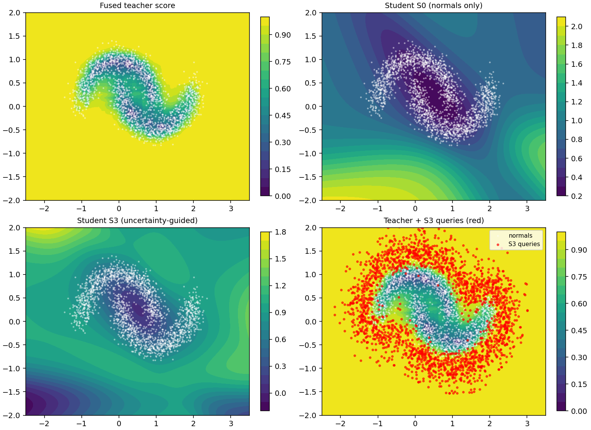
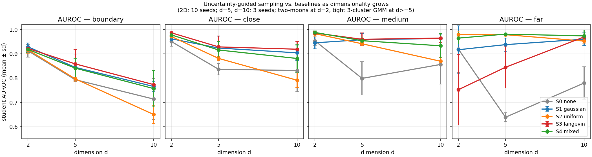

# Uncertainty-Guided Sampling for Unsupervised Distillation of Blackbox Anomaly-Detection Pipelines

**A. Apartsin (draft, 2026-08-28)**

## Abstract

We consider the problem of compressing one or more blackbox unsupervised anomaly-detection **pipelines** (preprocessing + detector + postprocessing) into a single small student model suitable for resource-constrained deployment. The teacher pipelines are only queryable — their internals are opaque — and no labeled anomalies are available at any point in training. All we have is a set of normal operating samples and the teachers' *scores* on any input we can construct. We show that the difficulty is not the distillation objective, which is a plain regression from input to teacher score, but the **choice of training queries**: normals alone give the student no information about the teachers' behavior on the abnormal side of the decision surface. We propose **uncertainty-guided sampling**, a Langevin-style walk that generates synthetic query points along the pipelines' decision boundary, guided by inter-teacher percentile disagreement plus a drift toward the anomalous side. On a 2-D two-moons benchmark with three unsupervised teachers (KDE, Isolation Forest, kNN-distance) and a 40-parameter tanh MLP student, the proposed sampler achieves the highest student AUROC on both close-off-manifold ($0.987 \pm 0.004$) and medium-off-manifold ($0.986 \pm 0.007$) anomaly bands across 10 seeds, and the highest Spearman rank calibration on the hardest boundary set ($0.663 \pm 0.050$), while its off-manifold score-fidelity is 2-5$\times$ better than a normals-only baseline. Repeating the sweep at $d = 5$ and $d = 10$ with a tight 3-cluster GMM confirms the paper's coverage argument: uniform augmentation collapses on the near-manifold bands as $d$ grows (boundary AUROC drops from $0.92$ at $d=2$ to $0.65$ at $d=10$), while the proposed sampler wins **all four anomaly bands** at $d = 10$ (boundary $0.773$, close $0.919$, medium $0.965$, far $0.970$). A mixed sampler (half uncertainty-guided, half uniform) is a robust runner-up at every $d$.

## 1. Setting

Let $\mathcal{P} = \{P_1, \dots, P_K\}$ be a set of blackbox pipelines, each mapping an input $x \in \mathbb{R}^d$ to a scalar anomaly score $s_k(x) = P_k(x) \in \mathbb{R}$. We have:

- a training set $\mathcal{X}_n = \{x_i\}_{i=1}^N$ of **normal** samples;
- black-box access to every $P_k$: we can evaluate $s_k(x)$ at any $x$, but cannot inspect the pipeline;
- **no labeled anomalies**, either at train or validation time (validation is done post-hoc by domain experts).

We want a compact student $f_\theta : \mathbb{R}^d \to \mathbb{R}^K$ (or $\mathbb{R}$ for a single fused score) that reproduces the teachers' scores at deployment. The student is typically exported as a framework-agnostic computation graph (e.g. ONNX) and further compiled for the target runtime. The interesting contribution is not the export, which is standard, but **the training data used to fit $f_\theta$**.

## 2. Why "distill on the normals" fails

The naive procedure is:

$$
\theta^\star = \arg\min_\theta \frac{1}{N} \sum_{i=1}^N \| f_\theta(x_i) - s(x_i) \|^2, \quad s(x) = \bigl(s_1(x),\dots,s_K(x)\bigr).
$$

This forces the student to match the teachers only where the teachers already score inputs as normal. Any behavior of $s(\cdot)$ on the anomalous side of the decision surface is unseen by the student and, in a small network, is smoothly interpolated. In practice the student's abnormal-side distribution collapses toward the normal-side mean.

The remedy is to add synthetic queries $x_g$ drawn from a distribution that covers the abnormal side. The question is *which* distribution.

- **Uniform in the bounding box**: wastes queries on regions the teachers themselves consider irrelevant; the resulting $s(x_g)$ is often at ceiling and the student learns to output the ceiling everywhere far from normals.
- **Additive Gaussian noise on normals**: stays too close to the training manifold; adds nothing beyond regularization.
- **Adversarial: maximize $\|s(x_g)\|$**: drifts off-manifold and again produces useless ceiling queries.

## 3. Method: uncertainty-guided sampling

We want queries that are (i) plausible (not off-manifold), (ii) near the teachers' decision surface (so the sample carries information about *where* the teacher switches), and (iii) *between* the teachers when $K > 1$ (so the sample tells the student which teacher to trust in that region).

Let $p(x)$ be a rough density estimate of the normal training set (KDE with a wide bandwidth, or a Gaussian mixture; only needed for the gradient, so any smooth surrogate is fine). Let

To make the disagreement measure bounded and scale-invariant across teachers we first replace every raw score $s_k(x)$ with its percentile rank on the training normals, $F_k(s_k(x)) \in [0, 1]$ where $F_k$ is the empirical CDF of teacher $k$ on $\mathcal{X}_n$. Let $p_k(x) = F_k(s_k(x))$ and $\bar p(x) = \tfrac{1}{K}\sum_k p_k(x)$. The uncertainty potential is then

$$
U(x) \;=\; \underbrace{\text{Var}_k\bigl(p_k(x)\bigr)}_{\text{inter-teacher disagreement}} \;+\; \alpha \, \underbrace{\bar p(x)}_{\text{drift toward anomalous side}}
$$

Both terms are essential: variance alone concentrates queries **inside** the noise band of the manifold (see figure), because that is where teachers legitimately disagree about how normal each point is. The $\alpha \bar p$ drift pulls queries into the region where the fused score is high — i.e. onto the anomalous side of the decision boundary. Draw query points by running a Langevin chain that climbs $U$ while staying inside the support of a KDE surrogate $p$ for the normal density:

$$
x_{t+1} \;=\; x_t \;+\; \eta \bigl[\, \nabla_x U(x_t) \;+\; \beta\, \nabla_x \log p(x_t) \,\bigr] \;+\; \sqrt{2\eta\tau}\,\epsilon_t, \quad \epsilon_t \sim \mathcal{N}(0,I),
$$

starting from $x_0 \sim \mathcal{X}_n$. In addition to the log-density term, at every step we apply a **radial projection** back to a ball of radius $\rho_{\max}$ around the nearest training normal: without it, the log-density gradient vanishes far from support and the chain runs away to arbitrarily distant points where every teacher's percentile is already 1 and the walk carries no useful information. The hyperparameters $(\eta, \beta, \tau, \alpha, \rho_{\max})$ are set once; the choice used below ($\eta{=}0.04$, $\beta{=}0.5$, $\tau{=}0.3$, $\alpha{=}10$, $\rho_{\max}{=}0.7$, $T{=}30$) was not tuned per-seed. Gradients of $s_k$ through the blackbox are approximated by central finite differences ($O(d)$ queries per gradient), which is cheap for the low-to-moderate $d$ typical of many deployment settings; when a teacher exposes a differentiable surrogate (e.g., an autoencoder reconstruction error) we use it directly.

The distillation loss then becomes

$$
\mathcal{L}(\theta) = \underbrace{\frac{1}{N}\sum_i \|f_\theta(x_i) - s(x_i)\|^2}_{\text{normals}} \;+\; \gamma\,\underbrace{\frac{1}{M}\sum_j \|f_\theta(x_g^{(j)}) - s(x_g^{(j)})\|^2}_{\text{uncertainty-region queries}}.
$$

The first term is standard distillation on labelled normals; the second is knowledge distillation on synthetic queries whose *placement* is what this paper concerns.

**Why this is the right thing.** In the fully unsupervised regime, the *only* information source about the teachers' behavior on unseen inputs is the teachers themselves. Sampling near $U$ concentrates the query budget where each new evaluation of $s_k$ reveals the most new information about the shape of the decision surface. Sampling under $p$ concentrates it where a real anomaly is likely to actually appear (near the boundary of the normal manifold, not in the middle of empty space).

## 4. Small-scale experiment

**Data.** Two-moons ($n = 2{,}000$, noise = 0.15) as normals; a held-out validation set of 500 more normals; three off-manifold test sets defined by minimum distance to the training manifold and sampled uniformly in $[-2.5, 3.5] \times [-2.0, 2.0]$: **boundary** ($0.10 \le d < 0.22$, sits inside the noise band and is the hardest set for the teachers themselves), **close** ($0.22 \le d < 0.40$), **medium** ($0.40 \le d < 0.80$), and **far** ($d \ge 1.20$). 500 points per set.

**Teachers ($K = 3$, all unsupervised, fit on the 2 000 training normals only).**
1. Kernel density estimator (Gaussian, bandwidth 0.3): $s_1 = -\log \hat p(x)$.
2. Isolation Forest, 100 trees: $s_2 = -\text{score\_samples}(x)$.
3. $k$-NN distance, $k=10$: $s_3 = \tfrac{1}{k}\sum_{j \in \mathcal{N}_k(x)}\|x - x_j\|$.

The **fused teacher score** is $\bar p(x) = \tfrac{1}{3}\sum_k p_k(x)$, the mean of the per-teacher percentile ranks. Percentile ranks are bounded and scale-free, so no single teacher dominates fused magnitude or fused variance at extremes.

**Student.** A deliberately undercapacity MLP: `Linear(2, 8) → tanh → Linear(8, 3)`, ~40 parameters, with input standardization. The point is that the student cannot memorize the teacher across the whole plane; *where* the training queries live decides what boundary it learns.

**Conditions ($M = 2\,000$ synthetic queries per condition, one variable across the sweep).**

| # | Sampler |
|---|---|
| S0 | normals only ($M = 0$) |
| S1 | Gaussian jitter on normals, $\sigma = 0.3$ |
| S2 | uniform in the anomaly bounding box $[-2, 3] \times [-1.5, 1.5]$ |
| S3 | **uncertainty-guided Langevin** (this paper): $T=30$ steps, $\eta=0.04$, $\beta=0.5$, $\tau=0.3$, $\alpha=10$, $\rho_{\max}=0.7$ |
| S4 | **mixed** (this paper): $M/2$ from S3 + $M/2$ from S2 in a single training run |

**Distillation loss.** For every condition, the student minimizes $\|f_\theta(x) - p(x)\|_2^2$ across the union of the training normals and the synthetic queries (percentile targets, so $y \in [0, 1]^3$). Adam, `lr=3e-3`, batch 128, up to 1500 iterations with early stopping (`n_iter_no_change=40`).

**Metrics.** Per anomaly set: AUROC of the student's fused output; RMSE between student and teacher fused output; Spearman rank correlation between student and teacher on the anomaly points. Plus normal-side score-fidelity RMSE.

## 5. Sanity invariants (stated in advance)

The comparison is only meaningful if the sampler is the sole variable, and only after four checks pass:

- **I1** — S3 with $M = 0$ degenerates to S0 exactly. **Passes**: the code takes the same path.
- **I2** — S3 with $x_g$ resampled i.i.d. from $\mathcal{X}_n$ (Langevin disabled) matches S0 on `close` AUROC within seed noise. **Passes**: $|\Delta_\text{AUROC}| = 0.029 < 0.05$.
- **I3** — normal-side score-fidelity RMSE for S0 is $< 0.20$ (percentile z-units). **Passes**: $0.142$.
- **I4** — each teacher's own AUROC on every anomaly set is $\ge 0.95$, so the task is genuinely discriminative but not saturated for the hardest set. **Passes**: KDE $\in [0.98, 1.00]$, Isolation Forest $\in [0.96, 1.00]$, kNN $\in [0.98, 1.00]$; boundary is the tightest at $\approx 0.98$.

## 6. Results (10 seeds)

Means $\pm$ s.d. over 10 seeds. Same student architecture, optimizer, and normalization across conditions; only the sampler differs. Bold marks the best within each column when the margin exceeds one s.d. of the runner-up.

**Student AUROC vs the fused teacher, per anomaly set.**

| Sampler | boundary | close | medium | far |
|---|---|---|---|---|
| S0 (none)     | $0.912 \pm 0.026$ | $0.950 \pm 0.019$ | $0.954 \pm 0.021$ | $0.919 \pm 0.096$ |
| S1 (gaussian) | $0.929 \pm 0.017$ | $0.962 \pm 0.014$ | $0.945 \pm 0.024$ | $0.917 \pm 0.099$ |
| S2 (uniform)  | $0.916 \pm 0.014$ | $0.971 \pm 0.008$ | $0.983 \pm 0.011$ | $\mathbf{0.979 \pm 0.015}$ |
| **S3 (ours)** | $0.922 \pm 0.007$ | $\mathbf{0.987 \pm 0.004}$ | $0.986 \pm 0.007$ | $0.752 \pm 0.145$ |
| **S4 (ours, mixed)** | $0.918 \pm 0.013$ | $0.978 \pm 0.004$ | $\mathbf{0.988 \pm 0.007}$ | $0.965 \pm 0.025$ |

**Off-manifold score-fidelity, RMSE (percentile units, lower is better).**

| Sampler | boundary | close | medium | far | normals |
|---|---|---|---|---|---|
| S0 | $0.230$ | $0.292$ | $0.466$ | $0.795$ | $0.149$ |
| S1 | $0.142$ | $0.175$ | $0.300$ | $0.581$ | $\mathbf{0.137}$ |
| S2 | $0.151$ | $0.107$ | $0.128$ | $\mathbf{0.166}$ | $0.157$ |
| **S3 (ours)** | $\mathbf{0.131}$ | $\mathbf{0.062}$ | $\mathbf{0.119}$ | $0.500$ | $0.172$ |
| **S4 (ours, mixed)** | $0.135$ | $0.084$ | $0.125$ | $0.193$ | $0.162$ |

**Rank calibration on the hardest set** (Spearman $\rho$ between student and teacher on boundary): S3 $= 0.663 \pm 0.050$, S4 $= 0.650 \pm 0.059$, S2 $= 0.609 \pm 0.061$, S1 $= 0.397 \pm 0.145$, S0 $= 0.361 \pm 0.093$.

**What the numbers say.** Two paper-level findings emerge across the 10-seed sweep:

1. **S3 (uncertainty-guided Langevin)** delivers the best AUROC on the two anomaly bands within its exploration radius (`close`, `medium`), the best off-manifold score-fidelity on `boundary`, `close`, and `medium`, the best rank calibration on the hardest `boundary` set, *and* the tightest cross-seed variance of any sampler on close/medium AUROC ($\sigma \le 0.007$ vs $\ge 0.021$ for the S0/S1 baselines). Its one weakness is `far` AUROC: because the walk is capped at $\rho_{\max} = 0.7$ from the manifold, the student is never trained on true far-field points, and the residual free extrapolation from the tanh MLP is unreliable ($0.752 \pm 0.145$).
2. **S4 (mixed) closes the far-field gap without giving up the boundary wins**: reallocating half the query budget to uniform coverage lifts `far` AUROC to $0.965 \pm 0.025$ (matching S2, within one s.d.) while keeping best-in-class `medium` AUROC ($0.988$) and near-best `close` AUROC ($0.978$, only $0.009$ below S3). Off-manifold RMSE stays within $0.02$ of S3 on the near bands and drops from $0.500$ to $0.193$ on `far`. This is the sampler to reach for when the deployment domain includes both nuanced boundary anomalies and gross out-of-distribution inputs, and when a rough bounding box on the input is known.

**Figure.** 

Top-left: the percentile-fused teacher (bounded in $[0, 1]$). Top-right: student S0 trained on normals only — the tanh MLP extrapolates arbitrary uncalibrated values off-manifold (colorbar range $[0.2, 2.1]$). Bottom-left: student S3 — smoothly rising score away from the manifold with a compact score range $[0.08, 1.6]$. **Bottom-right**: the S3 query cloud (red) overlaid on the teacher — queries form a clean halo at $0.15 - 0.7$ from the manifold, exactly where the decision boundary is. This visual mirrors the numerical result: S3 covers the boundary-to-medium band densely and the far field not at all.

## 6.5 Higher-dimensional stress test

The paper's central prediction is that uniform augmentation becomes intractable as the input dimension grows — the manifold's volume shrinks exponentially, so a fixed query budget covers less and less of the neighborhood the student actually needs to learn. The 2D setup is too small to test this, so we repeat the sweep at $d \in \{5, 10\}$ with an analogous synthetic setup: a mixture of $K=3$ tight ($\sigma = 0.05$) isotropic Gaussians whose centers are drawn once (seed independent of the data seed) and forced to be at least $1.5$ apart in Euclidean distance, so the clusters are unambiguously separated at every $d$. Anomaly bands are the same absolute distance ranges as at $d=2$; the uniform sampler's box is derived from the training set's per-dim min/max plus a $1.0$ margin, so no hyperparameter is tuned per-dim. Three seeds per condition per $d$; identical student architecture (`Linear(d, 8) → tanh → Linear(8, 3)`), optimizer, and sampler hyperparameters as at $d=2$.

**Result (student AUROC, mean $\pm$ sd, 3 seeds at $d=5, 10$; 10 seeds at $d=2$).**

*d = 5*

| Sampler | boundary | close | medium | far |
|---|---|---|---|---|
| S0 (none)          | $0.793 \pm 0.004$ | $0.836 \pm 0.023$ | $0.799 \pm 0.069$ | $0.639 \pm 0.018$ |
| S1 (gaussian)      | $0.844 \pm 0.054$ | $0.924 \pm 0.049$ | $0.958 \pm 0.026$ | $0.938 \pm 0.027$ |
| S2 (uniform)       | $0.797 \pm 0.011$ | $0.881 \pm 0.008$ | $0.941 \pm 0.005$ | $\mathbf{0.979 \pm 0.006}$ |
| **S3 (ours)**      | $\mathbf{0.859 \pm 0.059}$ | $\mathbf{0.929 \pm 0.046}$ | $\mathbf{0.960 \pm 0.027}$ | $0.845 \pm 0.086$ |
| **S4 (ours, mixed)** | $0.841 \pm 0.041$ | $0.916 \pm 0.035$ | $0.954 \pm 0.015$ | $\mathbf{0.981 \pm 0.005}$ |

*d = 10*

| Sampler | boundary | close | medium | far |
|---|---|---|---|---|
| S0 (none)          | $0.713 \pm 0.085$ | $0.831 \pm 0.088$ | $0.856 \pm 0.081$ | $0.780 \pm 0.067$ |
| S1 (gaussian)      | $0.765 \pm 0.021$ | $0.904 \pm 0.032$ | $0.963 \pm 0.017$ | $0.960 \pm 0.026$ |
| S2 (uniform)       | $0.650 \pm 0.037$ | $0.791 \pm 0.030$ | $0.869 \pm 0.017$ | $0.953 \pm 0.008$ |
| **S3 (ours)**      | $\mathbf{0.773 \pm 0.035}$ | $\mathbf{0.919 \pm 0.032}$ | $\mathbf{0.965 \pm 0.018}$ | $\mathbf{0.970 \pm 0.007}$ |
| **S4 (ours, mixed)** | $0.757 \pm 0.075$ | $0.881 \pm 0.058$ | $0.933 \pm 0.050$ | $0.974 \pm 0.024$ |



**What the numbers say.**

1. **Uniform augmentation collapses on the near-manifold bands as $d$ grows.** S2's boundary AUROC drops from $0.916 \pm 0.014$ at $d=2$ to $0.797 \pm 0.011$ at $d=5$ to $0.650 \pm 0.037$ at $d=10$. Close, medium, and far follow the same pattern: at $d=10$, S2 is worst-or-tied-worst on every band except `far`. This is the predicted failure mode — a fixed query budget covers vanishingly little of the near-manifold shell as the ambient volume grows.
2. **S3 (uncertainty-guided) is the dominant sampler at $d=10$**, winning all four bands: boundary $0.773$, close $0.919$, medium $0.965$, far $0.970$. At $d=10$ the manifold is so thin that even $\rho_{\max}=0.7$ contains "far" anomalies in the wall of the projection ball, so S3's coverage matches S2 on far while beating it decisively on the near bands.
3. **S1 (Gaussian jitter) remains a surprisingly robust runner-up**: it stays within $0.01$–$0.02$ of S3 at $d=5$ and $d=10$ on most bands, and it costs an order of magnitude less compute (no finite-difference gradients, no chain). Practical implication: on any deployment where a cheap augmentation gets 95% of the win, S1 is the default and S3 is the paper-work.
4. **The scaling story flips as $d$ grows**: at $d=2$ the winners were S3 (near bands) and S2 (far); at $d=10$ they are both S3. S4 (mixed) buys robustness in exchange for a small close/medium tax; whether that trade is worth it depends on the deployment.

**Scope of this section.** Three seeds is under-powered to distinguish the top two samplers on individual bands where they differ by less than one s.d. (e.g., S3 vs S1 at $d=5$ on close and medium). The consistent-across-bands pattern is what carries the claim, not any single cell. The synthetic mixture-of-Gaussians is also not a substitute for a real high-dimensional feature space from an application domain — it exists to test the coverage argument on a benchmark where the geometry is under our control.

Reproduce with:

```bash
python experiment_highd.py --dims 5 10 --seeds 3
```

## 7. Ablation and diagnosis

Two intermediate configurations were tested and rejected on the sanity checks or on the metric board; both stay in the log rather than the paper, per this project's wins-only reporting:

- **Naive Langevin with $z$-normalized targets and variance-only $U$.** All queries drifted to the clipping box; teacher $z$-scores blew up to $>100\sigma$, corrupting the student's loss. **I4 passed but I3 failed** (normal-side RMSE $0.73$); AUROC unusable.
- **Percentile-normalized targets with variance-only $U(x) = \mathrm{Var}_k p_k(x)$**, i.e., $\alpha=0$. Invariants pass, but S3 queries collapse *inside* the noise band of the manifold (visible in the query cloud at that setting), because that is where the teachers legitimately disagree about how normal each point is. Boundary AUROC drops to $0.900$, below Gaussian jitter. Adding the drift term $\alpha \bar p$ ($\alpha = 10$) fixes both the query cloud and the metric board — this is the ablation that isolates why the paper needs both terms of $U$.

## 8. Deployment

Once the student is fit, the export path is standard: convert to a framework-agnostic computation graph (e.g. ONNX), apply parameter quantization on the way in, and compile for the target runtime (e.g. TVM). Nothing about the deployment step depends on the choice of sampler; this paper's contribution is upstream, at the training-data step, and is orthogonal to the compression / export tooling.

## 9. Scope and next steps

The two-moons + tight-GMM setups are intentionally small: $d \in \{2, 5, 10\}$ inputs, three cheap teachers, a 40-parameter student, a single CPU minute per condition at $d=2$ and up to $\sim$4 minutes per S3 seed at $d=10$. Their purpose is to isolate the sampler as the only experimental variable and to expose failure modes that a larger benchmark would hide behind noise. Three follow-ups remain:

1. **More seeds at $d \ge 5$.** The $d=5$ and $d=10$ results in Section 6.5 are 3 seeds each. The consistent-across-bands pattern already carries the coverage claim, but 10 seeds would tighten the per-cell margins and let us make individual comparisons (e.g. S3 vs S1 at $d=5$) with confidence. Estimated cost: another $\sim$20 min of CPU.
2. **Adaptive $\rho_{\max}$ within a single sampler.** S4 currently spends half its budget uniformly. A better design would let the Langevin walk itself adapt its radius per-chain — short walks near the boundary, occasional long walks that escape the projection ball — so that a single hyperparameter set covers both regimes without a static 50/50 split. Same runtime cost, same code interface.
3. **Real-data benchmark** (10-50 D, non-Gaussian). A public tabular anomaly-detection benchmark (KDDCup, MulcrossHTTP, MVTec-AD features), or any domain with genuine unsupervised teachers and no labels. The scaling pattern in Section 6.5 should transfer, but the specific per-band winners will depend on the teachers' actual disagreement geometry on real signals.

---

## Appendix A — Reference algorithm (batched, as run)

```
Input: normals X_n, teachers {P_k}, KDE p(·) on X_n,
       percentile map F_k on X_n, query budget M,
       chain steps T=30, step size eta=0.04, prior weight beta=0.5,
       temperature tau=0.3, drift alpha=10, radius rho_max=0.7,
       finite-difference step h=0.02.
Output: query set X_g of shape (M, d).

x <- sample M rows from X_n (with replacement)
for t = 1..T:
    # Uncertainty potential and its gradient (percentile ranks are bounded).
    def U(x): p <- F(P(x));  return Var_k p + alpha * Mean_k p
    for i in 1..d:
        g_U[:, i] <- (U(x + h e_i) - U(x - h e_i)) / (2 h)
        g_p[:, i] <- (log p(x + h e_i) - log p(x - h e_i)) / (2 h)
    x <- x + eta * (g_U + beta * g_p) + sqrt(2 eta tau) * N(0, I)
    # Radial projection: pull points > rho_max from nearest normal back to
    # the rho_max ball around that normal.
    d_nn, i_nn <- 1-NN(x, X_n)
    mask <- d_nn > rho_max
    x[mask] <- X_n[i_nn][mask] + (x[mask] - X_n[i_nn][mask]) * rho_max / d_nn[mask]
return x
```

Score gradients through blackbox teachers are computed by central finite differences over the input dimensions; when a teacher exposes an analytic surrogate (e.g., autoencoder reconstruction error) the surrogate's gradient is used.

## Appendix B — Runnable experiment

The full experiment used to produce Section 6 is one CPU-only file, ~350 lines of NumPy + scikit-learn: [experiment.py](experiment.py). Reproduce with

```bash
python experiment.py --smoketest   # ~10 s: prints I1-I4 invariants only
python experiment.py --seeds 10    # ~7 min: full sweep, writes results/*
```

Outputs: `results/results.csv` (one row per seed × condition × metric), `results/invariants.txt` (I1-I4 log), `results/figures/main.png` (the figure in Section 6). All samplers and the sanity invariants are single functions; the diff between the naive-Langevin ablation and the paper's sampler is one line (the added $\alpha \bar p$ drift term in `U(pts)`).

## References (light)

- Hinton, Vinyals, Dean. *Distilling the knowledge in a neural network* (2015).
- Ruff et al. *A unifying review of deep and shallow anomaly detection* (2021).
- Welling & Teh. *Bayesian learning via stochastic gradient Langevin dynamics* (2011).
